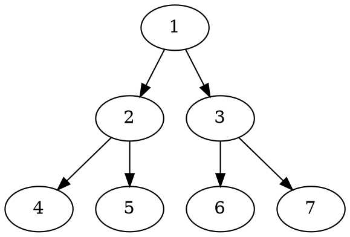

::: info Introduction

这是一个 hello-world 简介

:::

# 这是一个一级标题

这是一个普通文字内容

> 这是一个有背景的普通文字内容


随便放了两张图片👇，点击放大


--图片分割--


## 这是一个二级标题

```cpp

// 这是一个简单的代码内容

int main() {
    return 0;
}

```

一个mermaidjs 图：


一个plantuml图：

```plantuml

Bob -> Alice : hello

```

一个dot图



### 这是一个三级标题

> [!IMPORTANT]
>  这是一个特别的markdown 扩展内容，它兼容 github

#### 这是一个四级标题


1. 这是一个`html li` 内容
2. 是的，这和 `1.`一样


