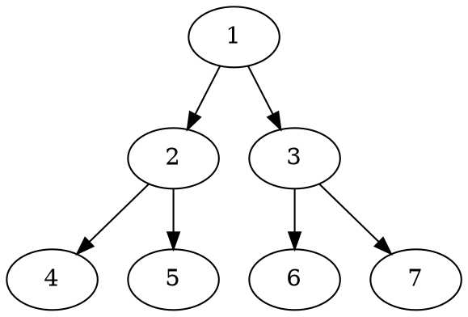

::: info Introduction

测试 Markdown-it plugin 画图插件是否显示完整

:::


### PlantUML

```plantuml
Bob -> Alice : hello
```
### DOT



### ditaa

```ditaa
+--------+   +-------+    +-------+
|        +---+ ditaa +--> |       |
|  Text  |   +-------+    |diagram|
|Document|   |!magic!|    |       |
|     {d}|   |       |    |       |
+---+----+   +-------+    +-------+
  :                         ^
  |       Lots of work      |
  +-------------------------+
```

### mermaid


