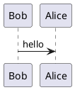
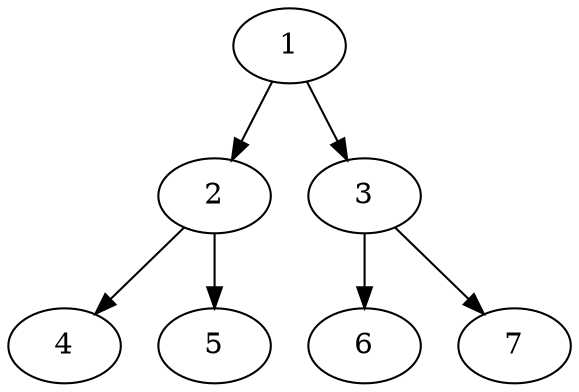

::: info Introduction

测试 Markdown-it plugin 画图插件是否显示完整
此插件:https://github.com/manastalukdar/markdown-it-textual-uml/tree/develop?tab=readme-ov-file

(感谢~)
:::


### PlantUML


### DOT



### ditaa

```ditaa
+--------+   +-------+    +-------+
|        +---+ ditaa +--> |       |
|  Text  |   +-------+    |diagram|
|Document|   |!magic!|    |       |
|     {d}|   |       |    |       |
+---+----+   +-------+    +-------+
  :                         ^
  |       Lots of work      |
  +-------------------------+
```

### mermaid


像个人网站的调整一直都在。但是更重要的是，blog应该有更好的内容。内容才是重要的，我不反对把个人网站装修的很好看，我反对的是网站很好看，但是没有内容，或者，在花里胡哨的地方花了太多时间。

我爱极简风格。

个人网站一直在调整，也在不断优化，更加欣喜的是，它有了一些内容，它正融入我的生活，我确实正在做有意义的事情。


关于我人生的问题，我的方向没有错，我正在提高效率。

我做的很不错，一切会好起来的。
