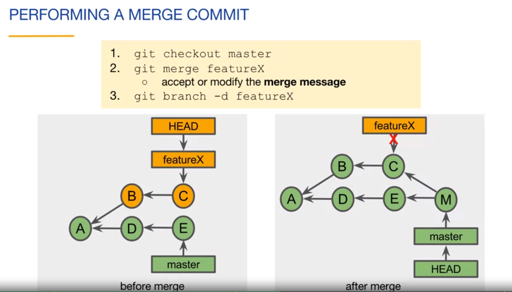
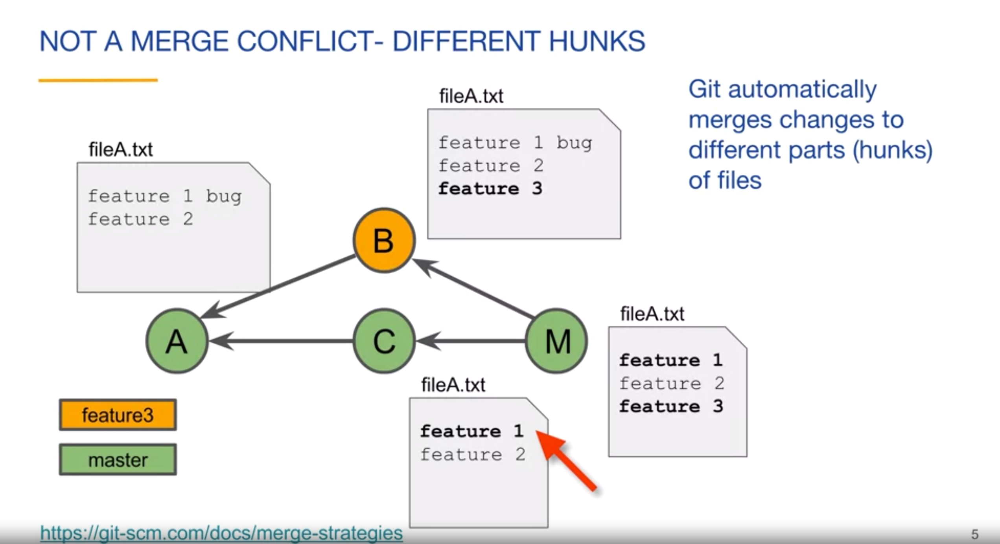
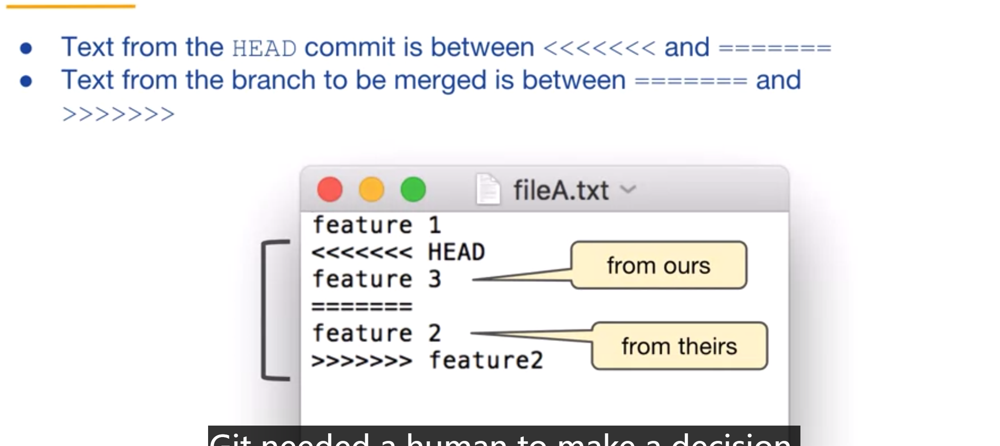
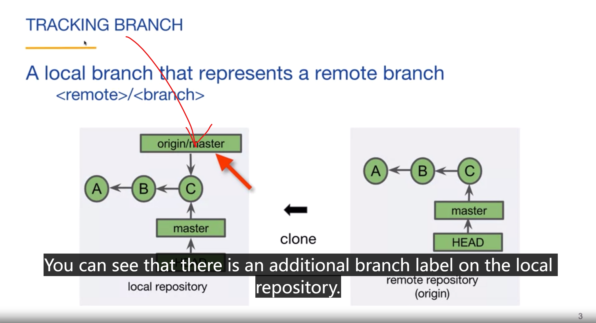
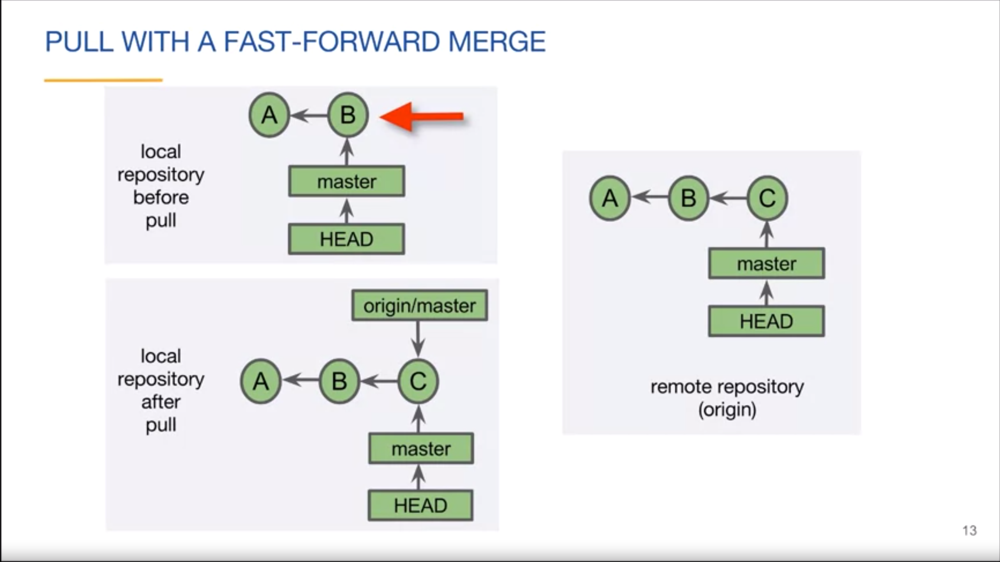
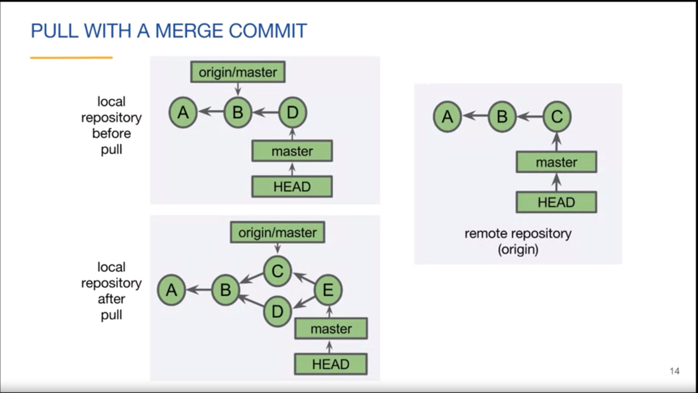
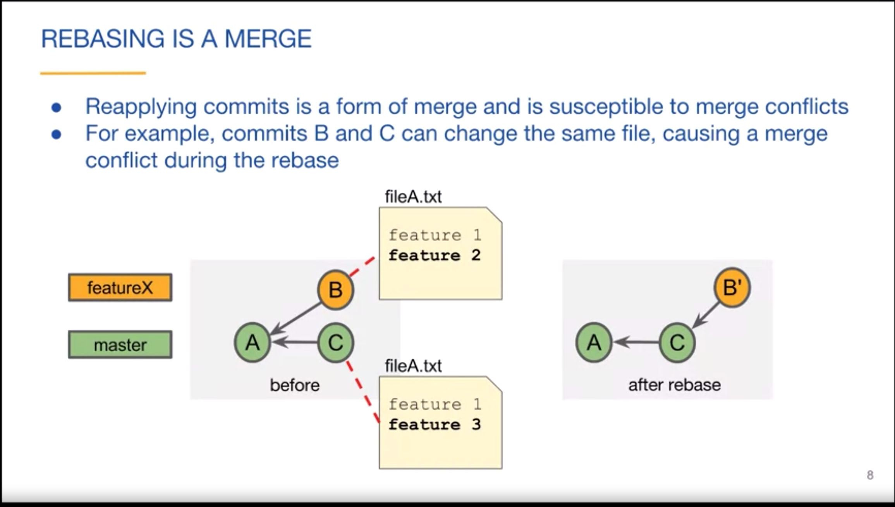
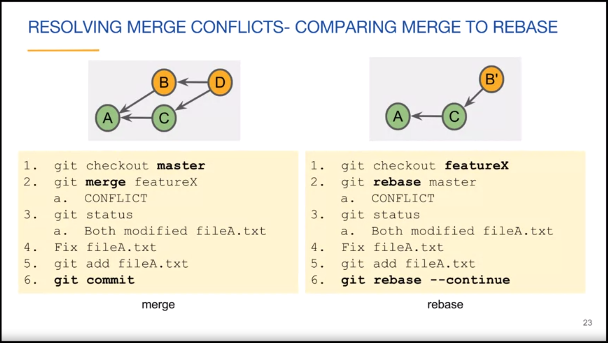

--- 
tags:
  - devops
keys:
  - git
---

::: info Introduction

每天都在用git,现在去系统的学习一下git吧，它是devops的基础~

中文和英文搭配确实显得很乱，这是我当前的状态，我学习的是英文资源，然后嘛，英文水平有限~

:::

**名词**
- commits
    - 一个功能或者bug修复的集合，一个 commit 的粒度尽可能小 
- branches
    - 并行处理各种问题，而不相互影响，一般分支中都有一个master分支 或者 main分支
- pull requests
    - 分支合并请求，在合并前会进行代码审核，自动化测试，代码格式话等，这将保证软件的质量。


git 主要做什么？ **版本控制**。它的一个特点是**分布式**，每个开发者都拥有一个完整的git仓库，这个仓库可以查看完整的仓库历史。

## git 基本语法和配置
**BASIC GIT  SYNTAX**: git [command] [--flags] [arguments]

### 特殊符号
|: Or

(): Grouping

git config [--local |--global | --system] \<key\> [\<value\>] 

- system: every repository for all users on the computer

- global: every repository for the current user on the computer

- local(or No flag): only for the current repository  

```bash
# notice: 如果使用github gh 这些都是可选的，不需要设置这些。。
# [set or get] user name and email and editor for the current repository
git config user.name ["name"|null for get]
git config user.email ["email"| null for get]
git config core.editor ["nvim"| null for get]

```

## git Locations

- Woring tree
  - contains the project files for a single commit
- Staging area
  - holds a list of files that will be included in the next commit
- local repository
  - contains all commits of the project
- Remote repository
  - contains all commits of the project on a remote computer
  
## git commits

`git status` to view the status of files in the working tree and staging area

**track**: untracked or tracked，tracked files are files that have been added to the staging area

`git add`:  add files to the staging area

`git commit`: Adds staged content to the local repository  as a commit
- Previously committed files are also included
- Creates a snapshot of the entire project.
`git log`: views the commit history of the current branch

## Push to a remote repository

`git clone`: create a local repository from a remote repository

`git remote --verbose`: Displays information about the remote repositories associated with the local repository

`git remote add <name> <url>`: adds a remote repository's information to the local repository

`git push [-u] [remote] [branch]`: pushed commits for a branch to a remote repository


## git branch and merge

### git objests

- commit: A small text file
- Annotated tag: a permanent reference to a commit
- Tree: Directories and filenames in the project
- Blob: The contents of a file in the project

a typical git user may only interact with the commit objects and tags

### git ids

the name of a git object 40-character hexadecimal string 
- with SHA-1 values
- git IDs are often shortened to the first four or more characters

### git references

known as a symbolic reference.

- HEAD: a symbolic reference to the current commit Usually points to the branch label of the current branch, one HEAD per repository

- ~ ： refers to a prior commit, ~1 is the parent of the current commit, ~2 is the grandparent, and so on
(~~ == ~2 ~--~1)

- ^: refers to a parent in a merge commit
   -  ^1 Or ^ refers to the first parent of a merge commit
   -  ^2 refers to the second parent of a merge commit
   -  ^^ first parent's first parent  
   
### git tags
> Reference/label attached to a specific commit

**Lightweight**

- A simple reference to a commit

**Annotated**

- A full Git object that references a commit  
- Includes tag author, date, and message, commit ID
- Optionally can be signed and verified with GPG

`git tag`:  lists all tags in the repository
  - Tags can be used to instead of branch labels or git IDS in git commands `git show v0.1`

  git tag \<tagname\> [\<commit\>]
  
  ```bash
  git tag v1.0 # tag the current commit named v1.0
  ```

  git tag  -a [-m \<msg\> | -F \<file\>] \<tagname\> [\<commit\>]
    - tag a commit with an annotated tag
    - \<commit\> defaults to HEAD

  Tags need extra transfer

  `git push [<remote>] --tags`
  
  but pull don't need extra OP.
  
### git branches

  `git branch`: see a list of branches 
  
  `git branch <name>`: create a branch

  `git checkout [-b] <branch_or_commit>`:  switch to the specified branch or commit
  - creates a new branch if the branch does not exist
  - switch to the specified branch if the branch exists
    - Updates the HEAD reference to point to the specified branch
    - Updates the working tree with the commit's files


**detached HEAD state**:  when you checkout a commit that is not the newest commit, you are in a detached HEAD state.


> 一个常用的操作是: 1 checkout 之前的一个commit, 创建另一个branch,修改 2 合并到当前分支。


`git branch -d <name>`: delete a branch **label**, it won't delete the commits


### git merge

`git merge <other_branch>`: merge the specified branch into the current branch
Main types of merges:

- Fast-forward merge:  

  - 
  - there are no new commit on master.
  - linear
- Merge commit:  
  - 

- Rebase:  when the current branch is a direct descendant of the branch being merged into
- Squash:  when the current branch and the branch being merged into have diverged


### merge conflicts

> git automatically merges changes to different parts(hunks) of files.



> Small frequent merges are the easiest


**the step of merge conflict**:

1. checkout master
2. Merge featureX
  - a . CONFLICT- Both modified fileA.txt
3. Fix fileA.txt
4. Stage fileA.txt
5. Commit the merge commit.
6. (Optionally) Delete the featureX branch


a conflict look like:




after you fixed conflicts, you can `git add ...` ,`git commit`.


### Tracking branch

> A branch that tracks represent a remote branch




`git branch --all`: Displays local and tracking branches

`git status`: includes tracking branch information


### git network commands

- Clone: Copies a remote repository
- Fetch: Retrieves new objects and references from a remote repository 
- Pull: Fetches and merges commits locally
- Push: Updates remote references 


Fetch the lastest commits:


- `git pull [<repository> [<branch>]`
  - Combines git fetch and git merge FETCH_HEAD
  - --ff(default) fast-forward if possible,otherwse perform a merge commit
  - --no-ff  always include a merge commit
  - --ff-only cancle instead of doing a merge commit
  - --rebase TODO

Pull with a fast-forward merge:



Pull with a merge commit:



- `git push [-u] [<repository> [<branch>]`
  - -u Track this branch(--set-upstream) 
  - if there are no branch,it will push all branch
  - there are a default repository
  

### git rebase

- Rebase
- Interactive rebase

**Rebase change commits history**

这和在同一个分支上开发，然后合并冲突有点像。



`git rebase <branch>`: rebase the current branch onto the specified branch

`git rebase <upstream> <branch>`: rebase branch to upstream.


`git rebase --continue`: continue rebase,after you **solved conflicts**.

merge vs rebase:




## git rewrite history

`git commit --amend`: change the last commit  message


internal rebase : 记住这个可以修改commits的历史就行了，为了显示项目的变化的完整历史，修改commit message，或者用创建一个新的commit覆盖会比较好，直接修改commit历史比较不好

Squash merge:  merge two commits into one


修改历史提交信息的步骤

1. `git rebase -i <commit>`: 在另一个基础上重新提交，所以，这行命令的commit是你要修改的commit的上一个commitID
2. 在弹出的nvim编辑行中，选择要修改的commit，在行首将pick改为edit
3. 保存退出，然后执行`git commit --amend`修改message信息
4. 保存退出，`git rebase --continue`完成！

## git pull request

- Pull requests are opened using an online Git host such as github
- the ultimate goal of a pull request is to merge a branch, but they also facilitate team discussion and code review
- you can open a pull request any time after creating the branch

the steps:

- Fork
- Clone
- Create a branch
- Make changes
- Push to your fork
- Create a pull request


