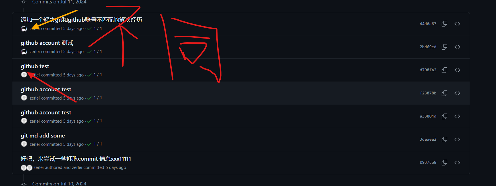

--- 
tags:
  - devops
keys:
  - git
  - github
---

::: info Introduction

每次向github 提交代码的时候，发现commit 作者和我的github 账号不匹配，这也导致了我的profile显示不出我最近的提交记录，总之，有点不好。 

:::

我的权限认证是一样的，但是 commit 记录仍然显示两个人。

1. 确定使用gh登陆账号并授权
2. 确定修改 git 的 user.email 和 user.name 与 github账号匹配

这次就好了。git 的提交纪录应该是：**相同邮箱被视为同一个人。**  出现不一样作者的原因可能是我的git 设置的邮箱和github 账号邮箱不一致。

