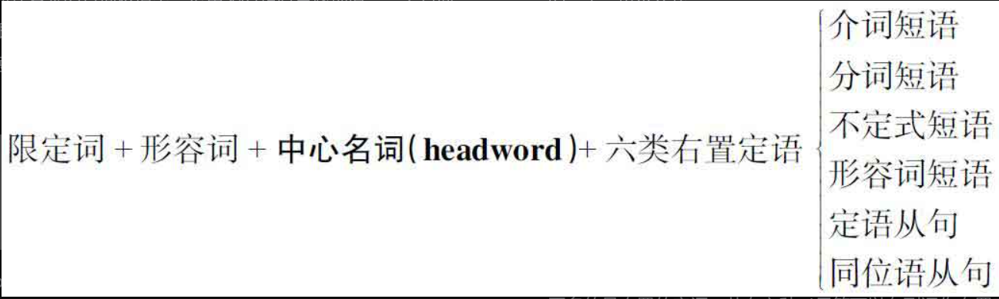

---
tags:
    - english
---

::: info Introduction

名词短语（noun phrase，简称NP）是英语句子的核心组成部分（a core element of a sentence）。 名词与它的修饰词一起构成名词短语。

:::

> 英语向来以语序固定严格而著称，英语被称为`固定词序语言(a fixed word order language)`

英语语言构造的5个层次：

- 词(word)
- 短语(phrase)
- 句子(sentence)
- 段落(paragraph)
- 篇章(discourse)

- 前置定语(定语)
    - 修饰词放在名词的前面
- 后置定语
    - 修饰词放在名词的后面
- 修饰词三种
    - 限定词 the a these these that those 等
    - 名词
    - 后置修饰语 the cute boy in blue jeans

左置的定语只有两个：限定词和形容词，而更多的是右置的定语，共有六种（尽管可以有副词作右置定语，但因较少用到，在此不作讨论）：介词短语、分词短语、不定式短语、形容词短语、定语从句以及同位语从句。

汉语被称作是“中心词（head）在后”的语言（head-last language）；英语被称作是“中心词在前”的语言（head-first language）。

