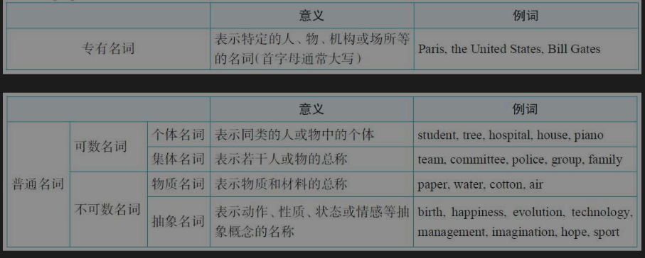

---
tags:
    - english
---

::: info Introduction

在汉语思维里，名词的可数和不可数的思维是缺少的。 
:::

## 名词

- 名词: A noun is a word that names a person, place, thing.
  - 专有名词(proper noun)
  - 普通名词(common noun)
    - 可数(countable noun)- [C]
    - 不可数(uncountable noun) - [U]

  

(好吧，记一下！)

**月份**:

- 1月 January
- 2月 February
- 3月 March
- 4月 April
- 5月 May
- 6月 June
- 7月 July
- 8月 August
- 9月 September
- 10月 October
- 11月 November
- 12月 December

**星期**:

- 星期一 Monday
- 星期二 Tuesday
- 星期三 Wednesday
- 星期四 Thursday
- 星期五 Friday
- 星期六 Saturday
- 星期日 Sunday

**季节**:

- 春季 Spring
- 夏季 Summer
- 秋季 Autumn
- 冬季 Winter

## 名词的可数与不可数

>  名词的可数和不可数关键在于它所表达的意义，而意义又随着语境的不同而改变，因而名词的可数性是与它所处的上下文语境密切相关的。不能孤立的看待名词的可数性。

> 名词的可数性重在意义而不是形式，与使用的语境有关，意义和语境的不同会导致名词的可数性不同。这是名词可数性的"相对论"

词典中标有[C]表示可数，[U]表示不可数，但是也有一些词，不同的意思下，表示可数或不可数。所以[C]和[U]可能同时标定同一个词。

**不可数名词有以下规律:**

1. 对于一些无法分割的名词，我们将其看作一个整体(nouns that have no distinct, separate parts,we look as the whole) eg: air coffee oil tea blood electricity water
2. 一些因其组成部分太小而不易数的名词。(nouns that have parts too small to count) eg: hair  corn rice sand
3. 表示总称的名词通常不可数(nouns that are classes or categories of things) eg: food fruit jewelry furniture.
4. 抽象的名词一般是不可数的(nouns that are abstractions) eg: advice fun life art patience time music truth
5. 表示研究学科(subjects of study) eg: biology chemistry physics history

有些名词，可数不可数分语境。

- 对于物质或总称的名词，若是表示不同的种类，或者因为特定的意思，或者是液体表示“几杯”或者“几瓶”，这样的数量，则转化为可数名词。
- 对于抽象名词，若是具体化了，则转化为可数名词。此时，往往伴随着词义上或大或小的改变。
- 从更广泛的意义上来说，当一个名词表示抽象的、总称的概念时，一般作为不可数名词来用，而当它表示具体的、特定的事物时，则通常作可数名词。

**不可数名词与量词**

用量词来表示不可数名词量的概念。

piece : advice bread baggage chalk equipment paper news 

bottle cup drop glass (液态物体): beer water

**不可数名词不能被a(n)修饰**

**不可数名词不能被基数词修饰**: one two three etc.

## 名词的单数复数

> 语意里面强调一个还是多个，是可数和不可数的的目的。

不可数名词与专有名词只能作单数

只能作复数的名词：

1. 二合一名词： glasses scales eg: where are my glasses?
2. 服装： jeans shorts briefs

**单形复义**： people,

但是people 用作 民族的意识就是可数的正常名词了。

**正常可数不可数**

1. 一般在词尾加-s
2. 以s, x, sh, ch结尾的名词加-es
3. 以辅音字母加y结尾的名词，变y为i加-es
4. 已元音字母加y结尾的词直接加 -s 如 boys monkeys
5. 以o结尾的名词，随便吧，别记规则了，记住单词吧，错就错了
6. 以f或fe结尾的名词，有时候会把f或fe变成ves，有时候直接加-s
7. 存在许多不规则的复数名词

有一些单复数同行的名词 sheep 动物 常见的国籍名称 chinese Japanese

有些词单数或者复数时有不同的含义。

custom(风俗) customs(海关)

> 关于名词的可数和不可数，记住一般的规则就可以了，如果将来碰到过这样的问题，再来查阅，如果碰不到，就此过去。犯一些错，也没有关系。

## 名词所有格 's

以s结尾的复数名词 + '  her friends' money.(没想到吧~)

对于使用and 联结的并列名词，当表示共有的情况下，只需在最后一个名词的词尾加 's 如果是各自所有，那么每个名词词尾都要加 's 

名词所有格表示的含义：

1. 所属 关系： women's clothes
2. 主谓关系： the teacher's request
3. 动宾关系： the children's education ( educat children)
4. 同位关系： My father's dead changes me deeply
5. 表示时间或距离，today's work

名词所有格有被省略的情况：

1. 避免名词重复：This bike is mine ,not Michael's
2. 表示店铺或者教堂 at the baker's  at the church's at the doctor's
3. 表示某人的住宅，go to my sister's

## of 属格

N1+of+N2

1. 表示无生命物体的所有关系 the roof of the church,  the name of the song
2. 当有生命的名词后面接短语或从句修饰时。 What is the name of the boy sitting next to her?

### of 属格的逻辑语意关系

1. 主谓关系： 从右往左翻译 the arrival of my friend
2. 动宾关系：从左往右翻译  America's invasion of Iraq  a statement fo the facts

若名词作不及物动词，必做主谓关系理解，但是如果动词既可作及物又可作不及物动词使用，则会产生麻烦，这要根据具体语境。

the shooting of the rebels 
- 叛乱者开枪扫射
- 开枪打死这些叛乱者

3. 同位关系 the city of rome .  the news of the team's victory

## 总结

中文和英文思维不同

