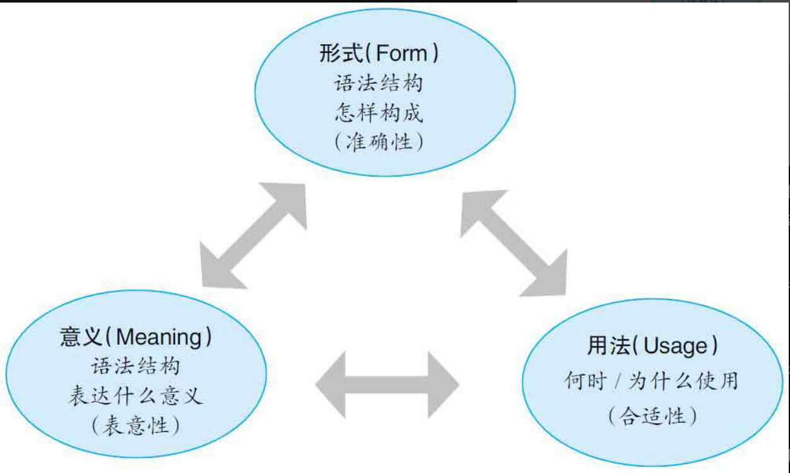

---
tags:
    - english
---

::: info Introduction

语法并不是 “规定你应该怎么说”，而是 “尽量”“系统地” 解释 “人们为什么普遍这么说。

:::

学习资料主要为《英文语法新思维》

语法是对语言表达习惯的归纳，总结出来的规律是为了对语言学习者正确引导，而不是严格限定；

语法规则不是一成不变的“死”规则；学习语法不能“死记”规则，而要理解规则背后的思维。

不能把“语法规则”看成是捆住自己英语手脚的“死规则”，而应该把它们当作是引导和帮助我们正确使用英语的“活思维”。简言之，语法不是“死规则”，而是“活思维。

- 语法源自语言，先有语言，后有语法。
- 语法不是一成不变的公式
- 语法不是随意的公式

词汇：

- 发音
- 形式(拼写)
- 意义，即单词的含义
- 用法

学习一个词汇，要经历一个完整的这个过程。

语法的三个要素：

