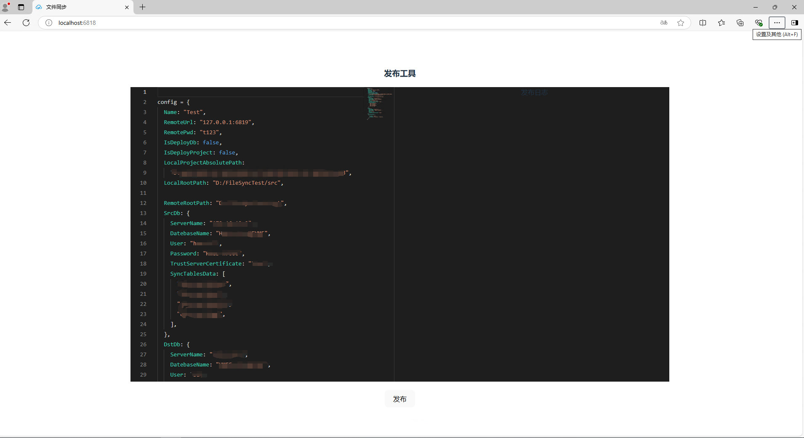
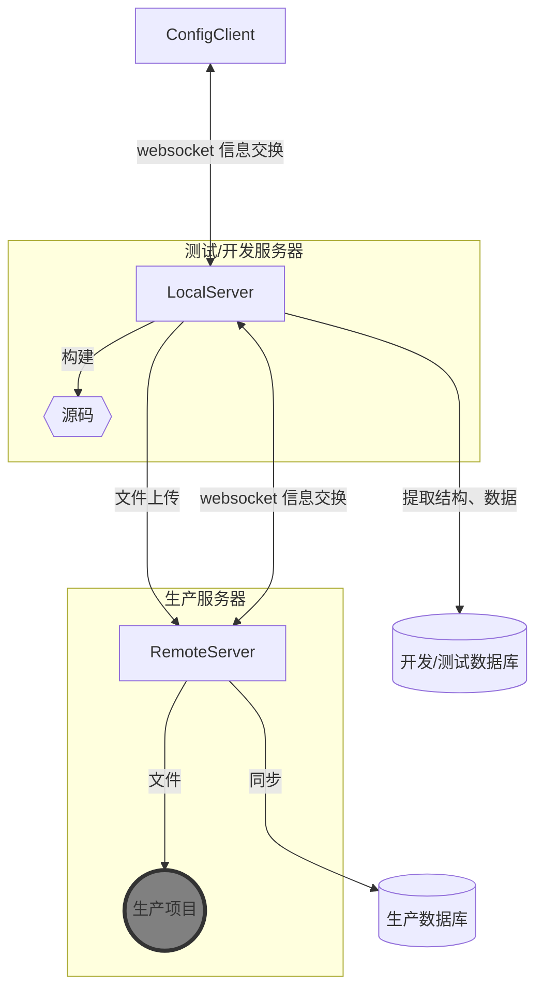

::: info Introduction

一个用于asp.net 项目集成发布的工具，它使用c#开发。它的作用是使不方便使用docker嵌入到现代CI/CD 流程的旧的asp.net framework 项目发布自动化。 

:::

它的功能包含：

- asp.net 项目build。使用[msbuild](https://learn.microsoft.com/zh-cn/visualstudio/msbuild/walkthrough-using-msbuild?view=vs-2022)
- 基于文件修改时间的本地 -> 服务器 文件同步
- 开发(或测试)sql server和生产 sql server 结构和特定表数据的同步 使用[sqlpackage](https://learn.microsoft.com/zh-cn/sql/tools/sqlpackage/sqlpackage?view=sql-server-ver16)

它的结构：

它的工作流程：

1. 在`ConfigClient`中配置，通过websocket 将配置传递给`LocalServer`,并展示从`localserver` 来的过程信息。配置主要包含源码位置，同步的文件，数据库配置等
2. `LocalServer` 根据配置连接 `RemoteServer`,构建项目，提取数据库信息，连接`RemoteServer`,与生产服务器的文件对比等。`LocalServer` 将差异文件和数据库压缩打包上传到生产服务器。
3. `RemoteServer` 解压文件，进行发布操作。

安全：

- 通信基于http,需要在在服务器开启特定的端口
- LocalServer 与 RemoteServer 的通信使用AES加密
- 差异文件加密压缩

使用环境：

1. 项目基于.net 8.0.x，所以需要.net 环境
2. 测试服务器需要完整的项目构建生产环境
3. 需要sqlpackage来提取、发布数据库。

具体详情[wiki](https://github.com/zhengyuanzhi/FileSqlServerSync/wiki)
