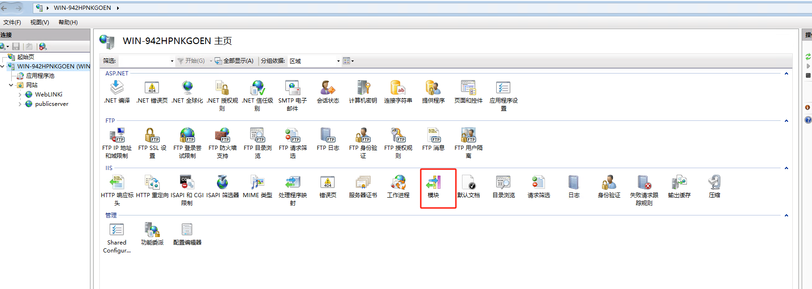
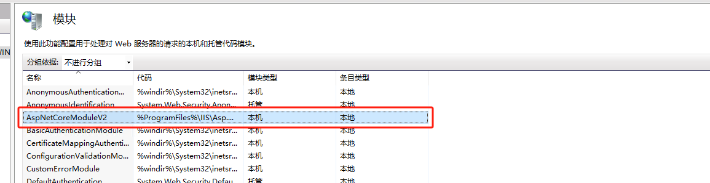
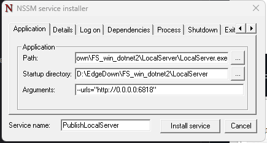

::: info Introduction

FileSqlServerSync的必要运行环境

测试/开发服务器：

1. .net 8 运行环境 
2. 源码
3. msbuild
4. sqlpackage
5. LocalServer的托管，IIS或者NSSM

发布服务器：

1. .net 8 运行环境
2. sqlpackage
3. RemoteServer的托管，IIS(最好)

:::

## 1. asp.net 8 

去这里下个环境就可以了。https://dotnet.microsoft.com/zh-cn/download/dotnet/8.0。
如果是构建需要下载sdk，托管下载运行环境。


## 2. IIS 托管 .net 8 程序

参考这里 https://learn.microsoft.com/zh-cn/aspnet/core/tutorials/publish-to-iis?view=aspnetcore-8.0&tabs=visual-studio

简单描述一下:

1. 需要下载一个文件安装，然后重启IIS
2. 当安装完成之后: 



在模块中可以看到：



这表示安装成功了。

3. 添加网站时选择：`无托管代码`


## 3. 直接运行 

使用 --urls 参数指定host ip 和端口 

```bash
./LocalServer.exe --urls="http://0.0.0.0:6818"

```

## 4. 使用NSSM 将程序打包成一个windows service

1. 下载nssm.exe https://nssm.cc/download
2. 解压完成之后:

```bash
./nssm.exe install
```
3. 在弹出的界面输入相应的参数



4. 在 windows server 中设置启动，是否开机启动

## 5. sqlpackage的安装

> sqlpackage 用来提取和发布sql server。安装sqlpackage的前置条件是dotnet 环境。

参考： https://learn.microsoft.com/zh-cn/sql/tools/sqlpackage/sqlpackage-download?view=sql-server-ver16

## 6. MSBuild.exe 的安装

msbuild.exe 用来构建 .net 项目 。当一个电脑上有项目的构建环境时，一般时visual studio，msbuild.exe 就已经安装了。

下一步时找到msbuild.exe 的正确位置：

1. 在当前使用的visual studio 中打开 开发者powershell命令行，它在菜单栏的 工具->命令行-> 开发者powershell

2. 输入命令，它的结果就是msbuild 的位置。

```pwsh
 (get-command msbuild).Source
```
