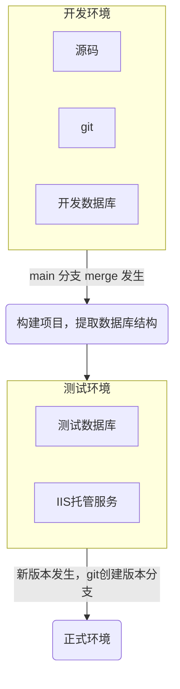
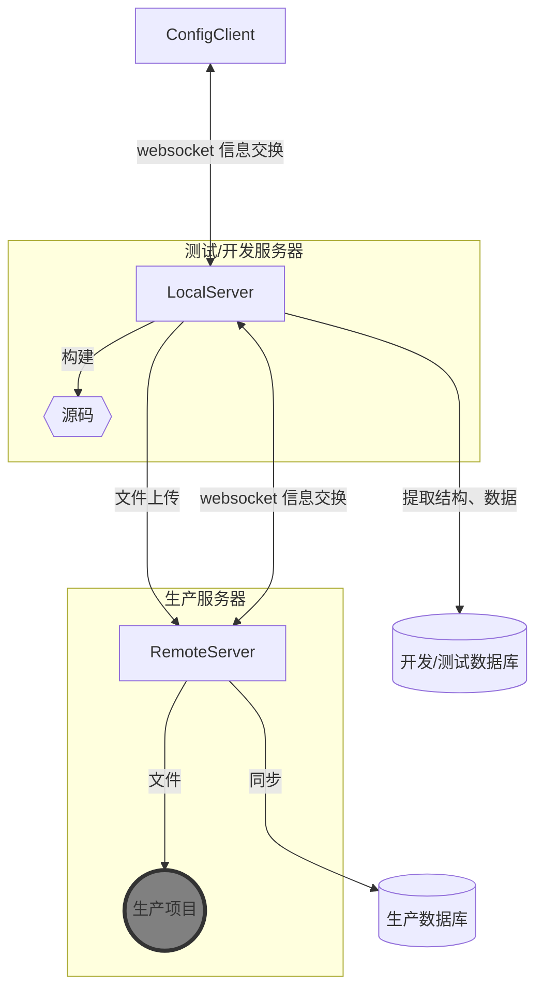

---
tags:
    - project
    - dotnet
key: 
    - 文件同步
---

::: info Introduction


一个用于 asp.net 项目集成发布的工具，它使用 c#开发。它的作用是使不方便使用 docker 嵌入到现代 CI/CD 流程的旧的 asp.net framework 项目发布自动化。


:::

源码及构建文件位置 https://github.com/zerlei/FileSqlServerSync


它解决问题的背景：

以docker和linux 为基础运行环境的devops 已经成了现代软件工程的标配。但是有一些老的项目例如使用asp.net framework 的web 服务还只能在windows 上运行，它太老了，现在的devops工具几乎不能用，而且项目使用新框架重构在当前几乎不可能。

对于业务密集型服务，更改经常发生，现存的手动构建复制新的变动程序文件和进行数据库结构更改效率很低，容易出错（看起来就很傻😑），所以需要一个工具能够在某件事(git hook 覆盖范围，或人的主观认定)发生时，能够自动化服务更新步骤。


它的一个典型的运行环境：



此过程，由git hook 触发 此工具工作，过程自动化。

它的功能包含：

- asp.net 项目 build。使用[msbuild](https://learn.microsoft.com/zh-cn/visualstudio/msbuild/walkthrough-using-msbuild?view=vs-2022)
- 基于文件修改时间的 本地 -> 服务器 文件同步
- 开发(或测试)sql server 和生产 sql server 结构和特定表数据的同步 使用[sqlpackage](https://learn.microsoft.com/zh-cn/sql/tools/sqlpackage/sqlpackage?view=sql-server-ver16)

它的结构：



它的工作流程：

1. 在`ConfigClient`中配置，通过 websocket 将配置传递给`LocalServer`,并展示从`localserver` 来的过程信息。配置主要包含源码位置，同步的文件，数据库配置等
2. `LocalServer` 根据配置连接 `RemoteServer`,构建项目，提取数据库信息，连接`RemoteServer`,与生产服务器的文件对比等。`LocalServer` 将差异文件和数据库压缩打包上传到生产服务器。
3. `RemoteServer` 解压文件，进行发布操作。

安全：

- 通信基于http(所有数据加密传输),需要在在服务器开启特定的端口。
- LocalServer 与 RemoteServer 的通信使用 AES 加密
- 差异文件加密压缩

使用环境：

1. 项目基于.net 8.0.x，所以需要.net 环境
2. 测试/开发服务器需要完整的项目构建生产环境
3. 需要 sqlpackage 来提取、发布数据库。
4. (可选) nssm，将程序注册为 windows 服务

> [!TIP]
> 不使用 IIS 托管的理由:
>
> 1. 托管最新的.net 程序而不是 .net framework 需要安装额外的插件
> 2. 无论是 LocalServer 还是 RemoteServer 都使用 websocket，IIS 在使用 websocket 受限
> 3. LocalServer 和 RemoteServer 都需要开启额外的进程，这可能与 IIS 的进程管理冲突


## 1. 部署

### 1.1 RemoteServer

> [!NOTE]
> 
> 通常是正式的运行环境。在此服务器上存在:
> 
> 1. 项目运行程序
> 2. 正式数据库部署于此，或者可以连接到正式数据库


需要具备以下环境：

1. .net 8 https://dotnet.microsoft.com/zh-cn/download/dotnet/8.0
2. RemoteServer 程序文件
3. sqlpackage https://learn.microsoft.com/zh-cn/sql/tools/sqlpackage/sqlpackage-download?view=sql-server-ver16
4. (可选) nssm.exe

在 RemoteServer 的 appsettings.json 文件中，配置一下参数

```json
{
 //缓存文件存储位置
 "TempDir": "D:\\FileSyncTest\\dtemp",
 // 发布的程序名称和密码 ['名称','密码']
  "NamePwds": [
    [ "Test", "t123" ],
    [ "FYMF", "FYMF" ]
  ],
  // 安装的sqlpackage 的绝对路径
  "SqlPackageAbPath": "C:\\Users\\ZHAOLEI\\.dotnet\\tools\\sqlpackage.exe"
}
```

获取 sqlpackage 的绝对路径(powershell)。
> [!NOTE]
> sqlpackage 有两种安装方式，通过 dotnet tool 安装需要获取sqlpackage路径。下载独立可运行的sqlpackage，它的目录就是解压目录
> 
```powershell
 (get-command sqlpackage).Source
```

(可选)使用 nssm.exe 将程序注册为 windows 服务。

在 nssm 的当前目录下：

```powershell
./nssm.exe install
```

之后在弹出的窗口输入应用程序的参数。

**Path**: RemoteServer.exe 的绝对路径

**Start directory**: RemoteServer.exe 所在目录

**Arguments**: --urls="http://0.0.0.0:6818" 指定监听的 ip(所有)和端口

**Service Name**: 服务名称


点击 Install service

在 Windows 服务中，启动设置此服务

### 1.2 LocalServer

> [!NOTE]
> 
> 通常是个人开发电脑，或者包含源代码的发布服务器


需要具备以下环境：

1. 项目源代码，以及开发环境(通常是 visual studio)
2. LocalServer 程序文件
3. sqlpackage https://learn.microsoft.com/zh-cn/sql/tools/sqlpackage/sqlpackage-download?view=sql-server-ver16
4. (可选) nssm.exe

在 LocalServer 的 appsettings.json 文件中，配置一下参数

```json

{
//缓存文件存储位置
"TempDir": "D:\\FileSyncTest\\stemp",
//安装的sqlpackage 的绝对路径
"SqlPackageAbPath": "C:\\Users\\ZHAOLEI\\.dotnet\\tools\\sqlpackage.exe",
// MSBuild 的绝对路径
"MSBuildAbPath": "C:\\Program Files\\Microsoft Visual Studio\\2022\\Community\\MSBuild\\Current\\Bin\\amd64\\MSBuild.exe"

}

```

获取 msbuild.exe 的绝对路径

1. 在当前使用的visual studio(可以打开编译项目的那个) 中打开 `开发者powershell命令行`，它在菜单栏的 `工具->命令行-> 开发者powershell`
2. 输入命令获取 msbuild.exe 的绝对路径
```powershell
 (get-command msbuild).Source

```

> [!IMPORTANT]
> 
> 使用 msbuild.exe 发布.net framework 项目时，不包含 .net framework 的程序集。（新版本.net 使用 dotnet 命令发布）
> 
> 这有两个解决办法：
> 
> - 第一次发布到新文件夹时，手动复制 bin/roslyn 的内容到新文件夹下相同位置, 发布文件夹也就是 config 中的
> 
> ```js 
> {
>   //源文件目录地址，是要发布的文件根目录，它是绝对路径，!执行发布时将发布到这个目录!
>   LocalRootPath: "D:/FileSyncTest/src",
> }
> ```
> 此后若此文件目录保持不变，就不要额外在手动复制了，所以需要手动复制一次。
> 
> - 使用 msdeploy.exe 在msbuild.exe构建之后打包，这是visual studio 的发布方式。这个需要更多配置，而且慢。
> 
> 现在这个项目使用第一种方式。

其余和RemoteServer 差不多。

### 1.3 (可选)ConfigClient 配置

这个工具现在又两种使用方式。

1. 命令行工具
2. web页面

使用web页面，无需再配置，在浏览器中，访问localserver，在页面中使用。

使用命令行工具需要

1. 安装 bunjs 
2. cd 到 release.js 所在目录
3. 执行 `bun install ` 安装脚本依赖


## 3 配置文件解释

在浏览器中方位LocalServer 的页面 或者 打开 release.js文件 

```js

config = {
  //发布的名称，每个项目具有唯一的一个名称
  Name: "Test",
  RemotePwd: "t123",
  //远程服务器地址，也就是发布的目的地，它是正式环境
  RemoteUrl: "127.0.0.1:6819",
  //是否发布数据库 sqlserver
  IsDeployDb: true,
  //是否发布前重新构建项目
  IsDeployProject: true,
  //项目地址
  LocalProjectAbsolutePath:
    "D:/git/HMES-H7-HNFY/HMES-H7-HNFYMF/HMES-H7-HNFYMF.WEB",
  //源文件目录地址，是要发布的文件根目录，它是绝对路径，!执行发布时将发布到这个目录!
  LocalRootPath: "D:/FileSyncTest/src",
  //目标文件目录地址，也就是部署服务的机器上的项目文件根目录，它是绝对路径
  RemoteRootPath: "D:/FileSyncTest/dst",
  //源数据库配置 SqlServer,将会同步数据库的结构
  SrcDb: {
    //Host
    ServerName: "172.16.12.2",
    //数据库名
    DatabaseName: "HMES_H7_HNFYMF",
    User: "hmes-h7",
    Password: "Hmes-h7666",
    //是否信任服务器证书
    TrustServerCertificate: "True",
    //同步的数据，这些数据将会同步
    SyncTablesData: [
      "dbo.sys_Button",
      "dbo.sys_Menu",
      "dbo.sys_Module",
      "dbo.sys_Page",
    ],
  },
  //目标数据库配置 sqlserver
  DstDb: {
    ServerName: "127.0.0.1",
    DatabaseName: "HMES_H7_HNFYMF",
    User: "sa",
    Password: "0",
    TrustServerCertificate: "True",
  },
  //子目录配置，每个子目录都有自己不同的发布策略，它是相对路径，即相对于LocalRootPath和RemoteRootPath(注意 '/'，这将拼成一个完整的路径)，文件数据依此进行,
  DirFileConfigs: [
    {
      DirPath: "/bin",
      //排除的文件或目录，它是相对路径，相对于！！！LocalRootPath和RemoteRootPath！！！
      Excludes: ["/roslyn", "/Views"],
      //只追踪文件或目录，它是相对路径，相对于！！！LocalRootPath和RemoteRootPath！！！，它的优先级最高，如果你指定了它的值，Excludes将会失效
      // CherryPicks:[]
    },
  ],
  //在执行步骤中执行的脚本命令(通常不需要使用)
  ExecProcesses: [],
  //  ExecProcesses:[
  //   {
  //     // 参数
  //     Argumnets:"ls",
  //     //  执行命令位置
  //     FileName:"powershell",
  //     // 相关步骤开始之前（B）或之后 (A)
  //     StepBeforeOrAfter:"A",
  //     // 本地（L）或远程 (R) 执行
  //     ExecInLocalOrServer:"L",
  //     // 步骤 1. 连接远程 2. 发布项目 3. 文件对比 4. 提取sqlserver 5. 打包上传 6. 发布
  //     Step:1
  //   }
  //  ]
};

```

这是一个实际项目使用的例子

```js

config = {
  Name: "FYMF",
  RemoteUrl: "212.129.223.183:6819",
  RemotePwd: "FYMF",
  IsDeployDb: false,
  IsDeployProject: true,
  LocalProjectAbsolutePath: "D:/git/HMES-H7-HNFY/HMES-H7-HNFYMF/HMES-H7-HNFYMF.WEB",
  LocalRootPath: "D:/FileSyncTest/src",
  RemoteRootPath: "E:/HMES_H7_HNFY_PREON",
  SrcDb: {
    ServerName: "172.16.12.2",
    DatabaseName: "HMES_H7_HNFYMF",
    User: "hmes-h7",
    Password: "Hmes-h7666",
    TrustServerCertificate: "True",
    SyncTablesData: [
      "dbo.sys_Button",
      "dbo.sys_Menu",
      "dbo.sys_Module",
      "dbo.sys_Page",
      "dbo.CommonPara"
    ]
  },
  DstDb: {
    ServerName: "172.16.80.1",
    DatabaseName: "HMES_H7_HNFYMF_PRE",
    User: "hnfypre",
    Password: "pre0823",
    TrustServerCertificate: "True"
  },
  DirFileConfigs: [
    {
      DirPath: "/",
      Excludes: [
        "Web.config",
        "Log",
        "Content",
        "fonts"
      ]
    }
  ],
  ExecProcesses: []
}
```
## 3 使用流程和典型的使用场景

> [!IMPORTANT]
> 
> 网络联通是必要的使用条件，不然咋传数据。
> 
> localserver 和 remoteserver 若处于不同的局域网中，可以借助公网传递数据。
> 
> 1. 使用 frp 做端口转发、内网穿透。需要公网IP。
> 2. 使用 cloudflare 做内网穿透，不需要公网ip,但需要域名。


当配置完成之后，

1. 在release.js 或者 localserver 的页面中，按需修改配置文件
2. 运行 release.js 或者点击页面中的发布按钮。


git 有hook，例如，可以配置每次合并到 master 分支并推送时自动发布。git hook 中`bun ./release.js ` 提供了这样的能力。


## 4 代码结构简单说明

**Server**： 主要内容

**Tool**: js 脚本和 vue写的页面，websocket 客户端。


### 4.1 Server 部分代码

三部分内容：

1. LocalServer 可执行程序
2. RemoteServer 可执行程序
3. ServerTest 测试

整个项目围绕两个模块展开

1. 文件对比操作，它实现了文件目录结构的对比，写入。
2. 同步步骤pipeline，它实现了数据传递，以及控制发布流程

## 5 常见问题排查

### 5.1 数据库同步失败

数据库同步的原理是：

1. 使用sqlpackage 提取发布数据库的信息，包含数据结构和特定表的数据，这一步骤会生成一个文件
2. 文件同步服务，将步骤(1)生成的文件上传到服务器上
3. 使用sqlpackage 将步骤(1) 生成的文件同步到生产数据库。

错误一般发生在步骤(3)，这个能是因为一些不安全的数据结构同步导致，例如改了一个字段的名称，或者删除一个字段。此时需要手动同步，也就是手动取更改表结构或者借助navicat 等工具。

`使用此命令手动同步，可以帮助排查问题。`
```
SqlPackage /Action:Publish  /SourceFile:./test.dacpac  /TargetServerName:127.0.0.1 /TargetDatabaseName:HMES_H7_HNFYMF /TargetUser:sa /TargetPassword:0 /TargetTrustServerCertificate:True 
```
