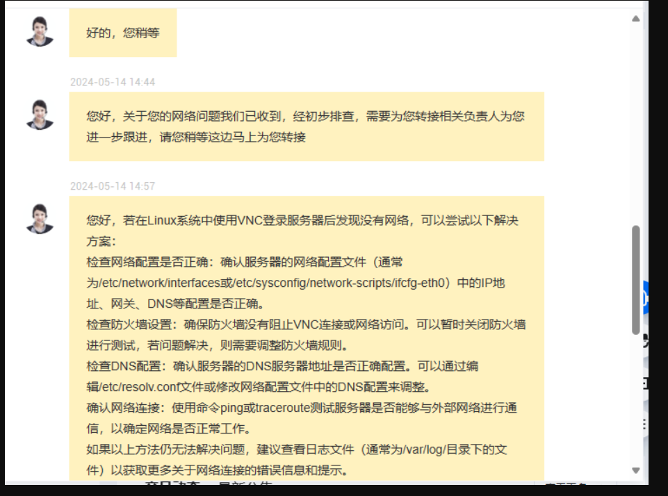
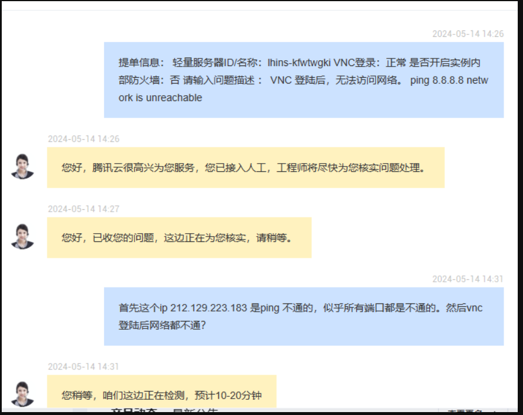

::: info Introduction

记录一次ubuntu云服务器的网络问题排查，重装python时导致 netplan 被卸载。联系腾讯云售后没有得到支持，但是爆了代金券，我给满分~

:::

## 1. 场景

将机器重启后，就没有及时关注，过两天后连ssh` 发现连不上了，首先检查本地电脑是否有网络，没有问题。然后登陆vnc,检查ssh服务状态。

```bash
sudo systemctl status ssh
```

服务正常启动，ssh配置文件应该不会有改动。云服务器的防火墙，是在控制台控制的，机器本身的防火墙默认是关闭的，然后检查机器的防火墙：

```bash
sudo iptables -L -n -v 
```

防火墙也没有什么问题。

这就有点奇怪了，然后在本地电脑上尝试ping云服务器的ip，发现ping 也ping不通；在云服务上，`ping 8.8.8.8` 也是ping不通的，现在可以判断，云服务器是断网了！

## 2. 解决过程

### 2.1 联系云服务器售后

因为是判断云服务断网(可能硬件故障？)，我不是运维，之前没有碰到这样的事情，联系售后，希望能蹭点经验。过程下来发现，售后指望不上。




### 2.2 问题排查

还是使用vnc 登陆云服务器。

**1. 确定网线是否联通**

```bash
ip -br link show
```

发现 `eth0` 是断开的。

将 `eth0` 打开：

```bash
ip link set eth0 up
```

再次查看 `eth0` 是否打开：

```bash
ip -br link show
```

确认打开了，查看 `eth0` 是否能收发数据包：

```bash
ip -s link show eth0
```
收发数据包正常，现在可以确定物理网络连接没有问题。

**2. 确定是否有ARP数据**

ARP(地址解析协议)  可以确定，本机是否与上游路由器相互识别。

```bash
ip neighbor show
```

我的ARP是空的，**这台服务器没有得到正确的ip地址?!**

查看网络配置信息：

```bash
ifconfig -a
```

此时，我才发现我的 `eth0` 根本没有ipv4地址 。

**3. 问题解决**

尝试：

```bash
sudo dhclient eth0
```

自动获取ipv4地址，一切正常了，但是为什么会没有ipv4地址呢? 之前也没有啥问题。。。

ubuntu 使用netplan管理网络配置，`cd /etc/netplan`,查看配置文件，对比之下，配置一切正常，没有什么问题。

使用 `dhclinet eth0` 可以使网络连接正常，但是重启之后，就无效了。于是尝试：

```bash
sudo  netplan apply 
```

netplan command not found ....   `netplan`啥时候没了?

安装 netplan.io：

```bash
sudo apt install netplan.io 
```

然后再`apply` 一次，一切正常了。

我之前用homebrew安装了python，后面因为homebrew安装llvm等有许多依赖问题，又把homebrew  卸掉了(以后再也不用了，linux上问题挺多)，不知道是不是和这个有关系。 

## 3. 总结

我多次接到腾讯云销售的电话，他们很积极，但是联系售后却很麻烦。这次故障和厂商没有关系，但是提供技术咨询是云服务器厂商提供的服务之一吗？

linux 只是内核，然后它的发行版众多，之间差别也很多。我还是更喜欢和更了解opensuse 的，但轻量云服务器不提供 opensuse 的镜像，我之前考虑过把云服务器装上opensuse，后来想想还是用ubuntu 算了，这样好沟通一些。目前来看，这个问题要重新考虑了，后续有时间把ubuntu 换成 opensuse 吧。

我用homebrew 装llvm 和 dotnet，总是遇到各种问题，后来把 homebrew 卸掉了，这后面又碰到一系列的问题。`netplan`没了，估计也和这件事情有关，使用homebrew 是因为，它可以很方便的获取最新的软件发行包，不过后面我要把云服务器系统换成滚动发行的 opensuse trumbleweed，homebrew 就基本不需要了。。。

## 3. 参考

1. [https://zhuanlan.zhihu.com/p/3705072432](https://zhuanlan.zhihu.com/p/3705072432)
2. [https://superuser.com/questions/237057/how-do-i-make-ubuntu-server-get-ipv4-address](https://superuser.com/questions/237057/how-do-i-make-ubuntu-server-get-ipv4-address)
