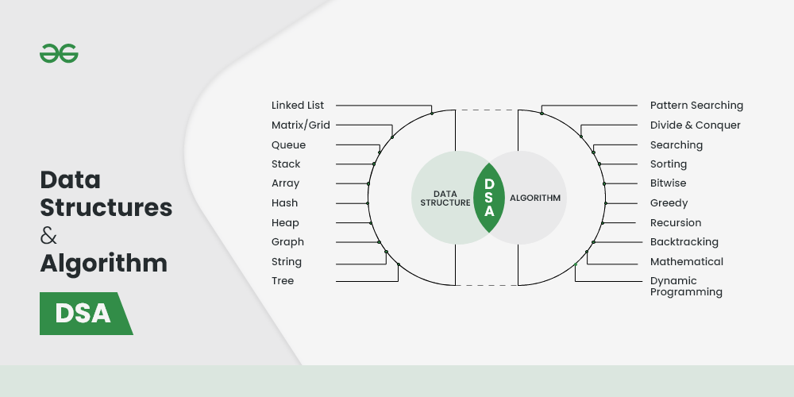

---
tags:
  - 算法&数据结构
  - todo
---

::: info Introduction

数据结构与算法的开章，学习内容，学习资源以及概念 测试123

:::

## 为什么算法和数据结构如此重要？

**数据结构**：你如何看待和解构一个事物，正确的认识是一切成功的开端

**算法**：为了达到你的目的，你如何优雅的操作数据结构

具体和现实的是：

1. 熟悉算法和数据结构的程序员比不熟悉的要更优秀，它表示你受过足够的训练，有优秀的逻辑。
2. 如果学一门新的编程语言，用它把基本的算法和数据结构实现一遍，是学习这门语言的最佳实践。

## DSA学习的基本内容

当然，这只是必不可少的开始，并非全部。

## 如何学习DSA?

1. 掌握时间复杂度和空间复杂度。
2. 学习上述的基本内容
3. 做足够的练习
4. 保持学习，这是一个大的方向，只有里程牌，没有终点

