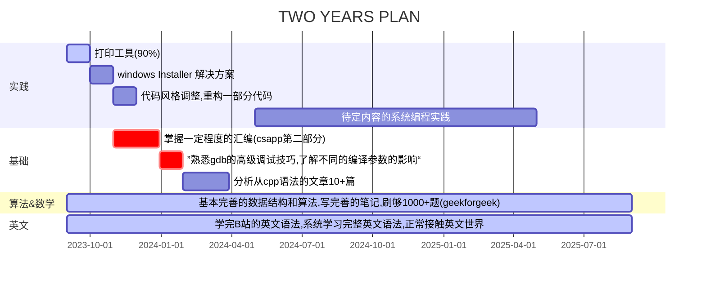

---
# https://vitepress.dev/reference/default-theme-home-page
layout: home
hero:
  name: Zerlei的学习笔记
  text: 很烂、没什么内容
  tagline: My experience, there are no worth content, very bad
features:
  - icon: 
      src: cpp.svg
    title: 制作 windows installer 的qt方案 
    details: 静态编译qt，链接大文件，制作无dll 依赖的安装包
    link: /note/
  - icon:
      src: cpp.svg
    title: 打印网页的自动化工具
    details: 根据一个url,打印网页，主要使用qt开发
  - icon:
      src: vue.svg
    title: 合格的前端搬砖工
    details: 用vue全家桶干活
---

<home />

