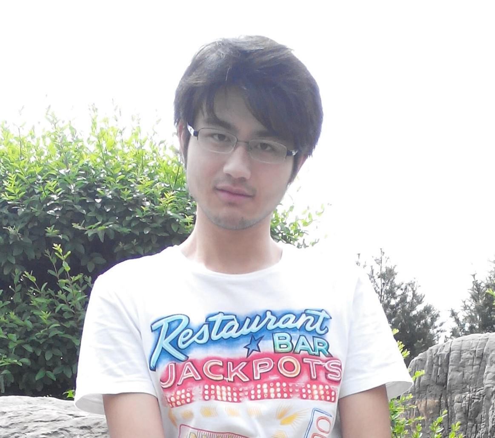

赵磊，男，90后，工人[^1]，程序员，["唯物主义信仰"](http://opinion.people.com.cn/n/2015/1019/c159301-27711780.html)。

 (这张照片拍摄于2014年5月份)

我在这样的环境长大，自然而然就是“唯物主义信仰”。

虽然，接触了许多的其它思想，但却越来越坚定的认同：我精神世界的不满意，一定是源于物质世界的某方面未得到满足，通过切实有效的行动改造物质世界，是解决精神世界不满意的最优方式。

没有办法通过改造物质世界的方式解决每一个烦恼或忧虑，此时，以物质世界为根基，重新塑造精神世界，接受现状，也是很好的解决措施，人就是有许多解决不了的事情。

也没必要每件事情都解决，烦恼和忧虑总是会有。

我对《庄子》和《周易》中描述的价值观感到痴迷，它们描述了无为，自强，谦逊，行动以及带给身边人价值或正向情绪等。

我不想过碌碌无为的生活，内心总有一股不甘心。我有很多想法，我正在努力拥有高效率的生活以支撑这些想法。高效率的生活的前提条件是精力充沛，所以第一步就是要做到高质量的睡眠。

我是个程序员：

<ProfileMe />

这个网站的内容主要是我的blog。

[^1]: 一些人可能会认为工人就是在工厂拧螺丝的那种，那只是工人的一部分，工人是指依靠工资收入生活的人，大多数人都是工人。这里说自己是工人的原因是: 1.告诫通过提升自身的劳动技能来获得更好的生活，不要往其它方面想 2.像劳斯莱斯是开不了啦，过普通的生活，少病少灾安稳过一生就行。

  
    <a href="https://beian.miit.gov.cn/">豫ICP备2023028578号 </a>
  
  |
  
    <a href="https://beian.mps.gov.cn/#/query/webSearch?code=41061102000409">豫公网安备41061102000409号</a>
  

<!-- 
这是成果展示，不是历程。它是要输出<<给别人看的>>，人们更关注结果，而不是过程。
只考虑当前的状态，而不考虑未来的情况，

所以此部分输出的是:

<<<我当前的成果！！！>>>
-->
