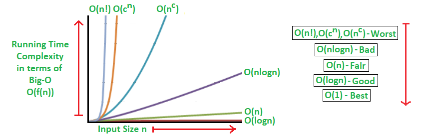

# DSA(算法和数据结构)

## 为什么算法和数据结构如此重要？

**数据结构**：它代表你对一个事物的认识，正确的认识是一切成功的开端。

**算法**：它代表你的行动

具体和现实的是：

1. 熟悉算法和数据结构的程序员比不熟悉的要更优秀，它表示你受过足够的训练，有优秀的逻辑。
2. 如果学一门新的编程语言，用它把基本的算法和数据结构实现一遍，是学习这门语言的最佳实践。


## DSA学习的基本内容


当然，这非全部。

## 如何学习DSA?

1. 掌握时间复杂度和空间复杂度。
2. 学习上述的基本内容
3. 做足够的练习
4. 保持学习，这是一个大的方向，只有里程牌，没有终点

## 实践复杂度和空间复杂度
::: tip
用来评判算法和数据结构的好坏
:::

如果一个算法，它用的时间和空间很少，那么我们不需要在乎它的复杂度。只有当复杂了，并且会造成一些障碍，我们才关注复杂度的问题。

复杂度有三种标记法,通常情况下我们使用表示最坏情况下的复杂度标记法：大O标记法，其余两个表示平均和最好。


常用的时间复杂度和比较



::: tip

复杂度中，时间复杂度要考虑的多一些。学习一个算法时考虑它的复杂度

:::

下面举一些例子。

### 1. 时间复杂度O(1),空间复杂度O(1)

```cpp

#include <iostream>
using namespace std;
 
int main()
{
    cout << "Hello World";
    return 0;
}
 
```

### 2. 时间复杂度O(n),空间复杂度O(1)

```cpp

#include <iostream>
using namespace std;
 
int main()
{
 
    int i, n = 8;
    for (i = 1; i <= n; i++) {
        cout << "Hello World !!!\n";
    }
    return 0;
}
 
```

### 3. 时间复杂度O(logn),空间复杂度O(1)

```js
for (i = 1; i <= 8; i=i*2) {
    console.log("Hello World !!!");
}
```

### 4. 时间复杂度O(log(logn)), 空间复杂度O(1)

```python

n = 8
i = 2
for j in range(2,n+1):
    if(i >= n):
        break
    print("Hello World !!!")  
    i *= i

```

### 5. 时间复杂度O(n),空间复杂度O(1)

```cpp

void f(int n) {
    for(int i=0;i<8;i++) {
        for(int j = 0;j<n;j++) {
            doSomething()
        }
    }
}
```


### 6. 时间复杂度O(n),空间复杂度O(1)

```cpp

void f(int n) {
    for(int i=0;i<n;i++) {
        for(int j = 0;j<8;j++) {
            doSomething()
        }
    }
}
```

### 7. 时间复杂度O(n),空间复杂度O(n)


```cpp

int ficc(int n) {
    if(n == 1) {
        return 1
    }
    return n*ficc(n-1)
}


```

### 8. 时间复杂度O(n^2),空间复杂度O(1)

```cpp

int f(int n) {
    for(int i=0;i<n;++i) {
        for(int j = i;j<n;++j) {
            doSomething()
        }
    }
}


```
