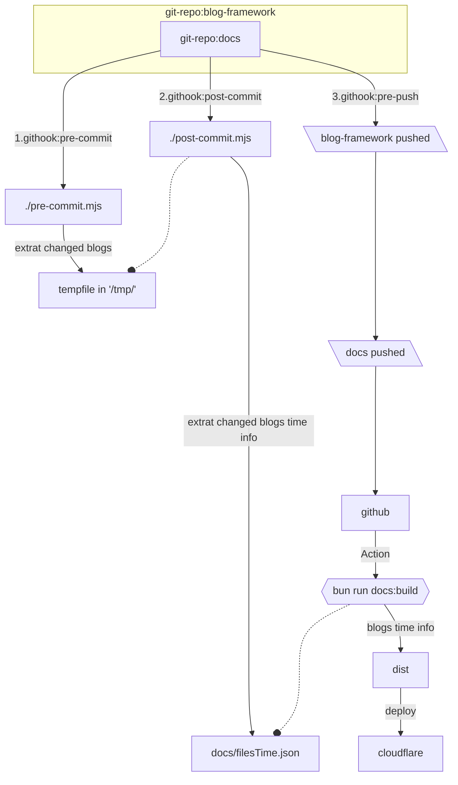

## 简介

一个基于 [vitepress](https://vitepress.dev/)的blog网站 example。

> [!TIP]
> vitepress 的目标是做一个上手即用的文档网站，vitepress的文档在描述对vitepress 个性化定制的方面上，内容较少（目前:2025年5月18日）。如果有一些特别的想法，除了翻文档之外，还需要查找更多的资料。
>
> vitepress 提供这些能力:
> 
> - 将markdown 文件编译成html，并根据文件路径添加路由，它还对markdown语法做了扩展
> - 它也是一个标准的 vue 项目，可以使用 vue 做各种个性化的定制
> - 有一些`yaml`风格的语法，用于定义主页，导航，页面的额外信息等

除了vitepress的开箱即用标准功能，这个项目还做了下面这些扩展：

1. 写了主页和blogs 的导航页面。可以根据 `tags` 分类，可以根据 `title` `tags` `Introduction`查找和筛选，可以控制blog是否显示在导航页面上。(vitepress 自带搜索功能，但不好用，有很多其它方案，一个常用的是使用https://www.algolia.com 来爬取页面信息，它提供更详细的搜索)
2. 左侧边导航自动生成。这对于写一系列文章特别有用，它将该系列文章显示到一个目录里面
3. 修改了一些样式，怎么说，默认的就很好，我改了一点，让我自己感觉更舒服一些
4. 从git中获取blog的创建时间和修改时间
5. 可以绘制 `mermaidJs` 和 `plantuml`
6. 图片箱，可以放大查看图片

> 有很多做blog或者文档网站的方式：
> 
> 偏向做项目文档的方式：
> 
> - **sphinx-doc**
>    - linux kernel 都在使用的文档工具
> - **doxygen**
>    - 非常适合 c++ 的文档生成工具

> 偏向做blog的方式：
> - **hexo**
>    - 应该是大多数人用的 
>
> 都还行的：
>
> - **Docusaurus**
>    - react 生态的一部分
> - **vitepress**
>    - vue 生态
> - **vuepress**
>    - vue 生态，但是 `vitepress` 是下一代


我我对vue 更熟悉一点,使用vitepress，可以更好的做一些个性化定制。

这个项目本来是作为自用的，但目前已经有两个小伙伴问我这个网站是怎么做的，有人感兴趣十分的不容易！

我把流程具体记录一下，它对我自己也是有帮助的，鄙人不擅长~~奔跑~~前端:)

> [!TIP]
> 许多blog做的非常炫酷，我当然很喜欢，也很羡慕，但是这需要
> 1. 非常好的审美(优秀前端的审美都很好！)我🤷🏼‍♂️
> 2. css 体操，我🤷🏼‍♂️
>
> 这个blog网站追求实用，风格以简单为主

## 准备材料

- 一个github账号
- 一个cloudflare 账号
- 一个域名(要花钱，可选，若没有，就只能使用组织的一级域名了，例如：cloudflare 的 https://blog-framework.pages.dev/  但没有 https://zerlei.cn)
- 一个图床(可选，如果没有，可以把图片资源放到 git repo 里面，这会导致仓库体积变大，发布会变慢)

## 打开项目

clone 项目：

```bash

# for github cli
gh repo clone zerlei/blog-framework

# or pure git: git clone https://github.com/zerlei/blog-framework.git

```
> [!CAUTION]
> `docs` 是**我的blog内容**作为这个repo的sub-repo，你不需要它。
> 
> 我拆分了仓库(之前只有一个仓库)，所以我的blog的创建时间和修改时间，丢失了之前的数据（因为它是从git中提取的）但影响有限，就这样吧～

(可选)将`docs`子仓库设为你自己的子仓库

```bash

git submodule set-url docs <your sub-repo url>

```
(可选)删除`docs`子仓库

```bash

git config -f .gitmodules --remove-section submodule.docs
git config --remove-section submodule.docs
git rm --cached docs
rm -rf docs/*
rm -rf .git/modules/docs

```

总之:

1. 你不需要我的子仓库 `docs`，
2. 你需要把你的blog，也就是markdow文件写在docs 文件夹下。

**我在 `docs-example`中写了一些例子，你可以把这些文件复制到 `docs目录里面看看效果`**

假设你的docs文件夹里面的内容已经是 docs-example 的内容了：

```bash

# 我用的是 bunjs，强👍

bun install
bun run docs:dev

```

## 功能

> [!IMPORTANT]
> 一切的前提是：**应该先熟悉标准的[vitepress](https://vitepress.dev/)内容**

### 1. markdown 文件头格式

举个例子：

```md
---
title: 建一个blog网站
export: true
tags:
  - project
  - web
keys:
  - vitepress
---

::: info Introduction

如何搭建一个个人网站。

:::

```
没有任何参数是必须的。

`title`: 此 blog 名称，若不提供，它会是此markdown文件的文件名，大部分情况下都不需要写

`tags`: 分类标签，它是一个array,正常情况下，应该有至少一个

`export`: true|false 或者不写。这篇文章是否要导出，下面会有详细的说明

`keys`: 加一个标签，但是不分类，所以就只有一个显示效果，它是一个array

`hidden`: true|false 是否在导航页面显示

`::: info Introduction YOUR_TEXT :::`: 这是一个 vitepress提供的markdown扩展语法。在这里，它是这篇blog的简介。**如果不提供，这个blog 将会是 `hidden: true`的**

如图👇


> [!IMPORTANT]
> 当`hidden: true` 时，这篇blog 不会在导航页面显示。它不等于build 的时候没有生成它，这意味着，一个正确的url可以访问到这个页面。
> 
> 当这个页面处于一个导航目录（see blow）下，可以在导航目录看到它
> 
> 如果不想build的时候生成这个blog(不存在路由，所以浏览器访问的时候，无论如何都无法看到)，vitepress提供了指定文档目录的功能。

### 2. 目录chunk

正常的blog 是前后不关联的。如果你为一个主题写了一系列blogs，想把它们前后关联起来

此时，项目文件结构应该类似：

```
.
├── deep1
│   └── deep2_ca
│       ├── 1-blog-d2.md
│       └── 2-blog-d2.md
├── deep1_ca
│   ├── 1-blog-d1
│   │   └── 1-1-blog-d1.md
│   ├── 1-blog-d1.md
│   └── 2-blog-d1.md
└── hello-world.md


```
**对应的文件夹名称应该添加`_ca`后缀**，效果：


> [!NOTE]
> 目录可以嵌套，如果指定了一个文件夹的blog生成目录(也就是后缀为`_ca`)，它的所有子文件夹也将是目录的一部分。


### 3. 绘制dot、plantuml 和 mermaidJs图

按照标准markdown 语法正常写代码块就可以了。

plantuml 默认的渲染 server 需要公网。参考 `PlantumlOptions`(.vitepress/theme/lib/types.ts)

### 4. 控制blog `发布` 和 `未发布`

参考 *1. markdown文件头格式*。默认是`未发布的`，如果指定了`export: true`，这个blog将变成 `发布的`。

当网站打开时，只能看到`发布的`内容。如果在搜索框，进行了下列行为之一：

1. ctlr+鼠标左键点击搜索框
2. 输入@sw

blog将在`全部内容` 和 `发布的` 之间切换。

> [!CAUTION]
> 这只控制相关blog是否在导航页面显示。它的路由是存在的（也就是说，一个正确的url可以访问任意的blog，无论它是否标记了`export`，对于`hidden: true`，也是一样的） 
> 


### 5. 自动获取blog的创建时间，和修改时间

> 最初的时候，这个项目使用系统上的文件创建时间和修改时间。但是git 提取文件信息的时候，不会包含它们；所以，当项目重新 clone之后，所有的文件时间信息都是错的。

现在使用git 记录的时间作为blog的创建时间和修改时间。

核心命令：

```js

const createTimeResult = await $`git log --pretty=format:"%ai" -- ${file} | tail -1`;
const modifyTimeResult = await $`git log -1 --pretty=format:"%ai" -- ${file}`;

```
写bash 不舒服，我使用[zx](https://github.com/google/zx) 作为脚本执行工具。


### 6. 使用git hook自动化

自动化流程完成下面的任务：

1. commit时，自动获取md文件的时间信息
2. push 子仓库之后也就是 `docs`仓库后，把父仓库推送出去。

自动化流程和这些文件有关:

- `docs`仓库hook: pre-commit
- `docs`仓库hook: post-commit
- `docs`仓库hook: pre-push
- `docs`仓库blogs时间json: filesTime.json

- `blog-framework`仓库：pre-commit.mjs
- `blog-framework`仓库：post-commit.mjs

除了上面的文件，还有一个文件可能会有帮助：

- `blog-framework`仓库：filestimeinfo.mjs。它用于一次性生成所有的blogs时间信息(pre-commit.mjs 在filesTime.json 的基础上，只更新当前git status 的变动文件信息)


整个流程：



1. 在docs 写blogs
2. 写完，commit，git hook自动生成文件时间信息(filesTime.json变动了，hook中再次add，commit --amend，同时，使用环境变量避免递归调用)
3. push git:docs，git hook pre-push先把父 git-repo 也就是 blog-framework 更新提交

实现过程十分魔怔，不过最后的效果是：**多余的步骤，一个也没有**

### 7. 使用cloudflare托管页面

> [!TIP]
> cloudflare 是赛博菩萨！！！
>
> 使用cloudflare pages 有以下作用：
> 
> 1. 防止网络攻击
> 2. 自动https代理，现在免费的证书有效期只有3个月了，cloudflare 会自动帮你申请证书，这个真的非常方便
> 3. 和github集成，push后自动发布
> 
> 我把域名的DNS解析放到了cloudflare 上了


> [!CAUTION]
> cloudflare page 可以直接使用github repo 来发布，但是我的 `docs` 子仓库是 private 的 ，cloudflare 免费版，**page 不支持git 子仓库为private的发布**

使用github action 构建，然后将构建产物上传到cloudflare page 上。`./deploy.yaml`

### 8. 做个图床

> 为了静态资源，主要是图片

NAS实在是太多了。

我是这样做的：

1. 拼多多购物 微型工控机+1TB固态硬盘：共计rmb 550左右
2. 装opensuse 系统
3. 安装 [cloudreve](https://cloudreve.org/) 服务
4. cloudflare zero trust DNS解析到cloudreve服务上
5. frp内网穿透（我有个云服务器，所以有公网ip） -- 为了远程维护，但是我基本没维护过
6. 插⚡和家庭网络。一个月1到2快的电费

在家庭网络使用内网访问，是非常快的！

我还没有发现过比这个性价比更高的方式:)

