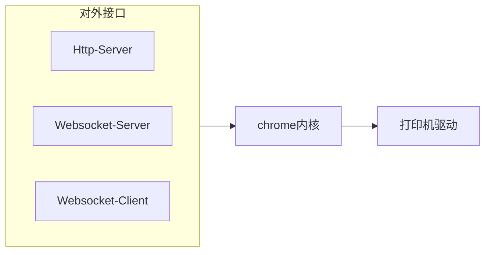

# 一个实现网页打印自动化的工具

假设你在开发一个后台管理系统，你使用web技术来开发前端，你的客户通过浏览器访问你的应用。你可能会有这样的需求，把一些信息打印到纸张之上。你的做法如下：

1. 使用html和css来制作符合打印需求的静态内容，使用js嵌入一些动态内容
2. 借用第三方组件，或者直接使用`window.print()`，当你的用户做出类似于点击一个按钮这样的操作时，打开浏览器的打印预览对话框
3. 你的用户在浏览器的打印预览对话框里进行下一步的选择打印机、纸张等操作

这种情况下，每一个打印需求都需要你的用户手动触发。如果打印经常发生，你可能会考虑，可以让这个流程自动化吗？我们预先配置好打印机、打印格式等，当打印需求产生时不需要用户手动触发打印，而是让打印自动完成。

因为浏览器的安全策略，在常规浏览器上仅仅依靠网页是无法完成的，这个小工具的作用就是帮助你实现网页的自动化打印，它是一个客户端软件，你需要把它安装在能连接相应打印机的电脑上。

我们来看看它的组成。



你可以通过三种方式与它交互。

1. http请求的方式。
2. 使用websocket客户端，去连接它的websocket 服务的方式
3. 你有一个websocket服务，告诉它这个服务的地址，它会去连接你的websocket服务。

不同的接口适用于不同的场景。

::: warning


**如果你使用Http请求的方式，并且发起http请求的地点是在浏览器的网页上**，请注意[更私有的跨域策略](https://wicg.github.io/private-network-access/)

你可以在chrome内核浏览器中设置 chrome://flags/#block-insecure-private-network-requests 为disabled 来避免更私有的跨域策略。

它的http返回头已包含：

```javascript
Access-Control-Allow-Origin:*
Access-Control-Allow-Methods: GET, POST
Access-Control-Allow-Private-Network: true
Access-Control-Allow-Credentials: true
```
建议使用fetch，以避免其它的跨域。

:::


## $0 安装

这个软件需要安装，去[这里](https://github.com/ZhaoYouYa/webpage_printtool/releases/tag/web)下载一个安装包，然后安装就可以了。


::: tip

1. 安装包仅支持windows 64位。qt是跨平台的，如果你有其它需求，可以自行编译。
2. 安装位置在 C:\\Program Files\\PrintWebPage中。同时安装过程中，会添加一个注册表项在HKEY_CURRENT_USER\\Software\\Microsoft\\Windows\\CurrentVersion\\Run 中，名字是：PrintWebPage，用于**开机启动**。
3. 如果安装过程中有一些问题，去[这里](https://aka.ms/vs/17/release/vc_redist.x64.exe)下载一个最新的vc++运行时包,或者搜索最新的windows c++ runtime。

:::
## $1 功能和接口注释

当你安装完毕后，就可以使用接口与它交互了。所有数据都是json格式。源码目录里的`test`文件夹下的内容，是一些例子。你也可以看看，这个工具自带配置页面，它主要是使用websocket与交互的。

### $1.1 获得工具安装电脑上的打印机和纸张信息

*请求：*
```json
{
    "Id": "your id",
    "MsgType": "GetPrintInfo"
}
```

*返回：*
```json
{
    "Id":"your id",
    "IsSuccess": true,
    "Result": [
        {
            "Papers": [
                {
                    "Id": 0,
                    "Key": "Letter",
                    "PaperName": "\u4fe1\u7eb8",
                    "PaperSize": "215.9_279.4mm"
                },
            ],
            "PrinterName":"\u5bfc\u51fa\u4e3aWPS PDF"
        }

    
    ]

}

```

Id：由你来指定，用来标识一个请求。工具给你的返回中将携带这个值。它在你使用websocket时有用，如果你不需要它，可以传**空字符串，不要传递其它类型参数或者忽视它**

MsgType:请求的类型，这里 `GetPrintInfo` 就是获得电脑上的打印机和纸张信息。

Result：你需要的信息一般在接口返回的这个字段里，在这个请求中:`PrinterName`,表示这个打印机的名称，`Papers`,这个打印机支持的纸张。


### $1.2 添加一个打印机配置

根据 1.1 返回的信息,你应该配置一下打印机。

*请求：*
```json
{
    "Id": "your id",
    "MsgType": "AddOnePrintConfig",
    "Data": {
        "Name": "Hi",
        "PrinterName": "导出为WPS PDF",
        "TopMargin": 0,
        "BottomMargin": 1,
        "LeftMargin": 2,
        "RightMargin": 2,
        "Orientation": "横向",
        "PaperName": "A4"
    }
}
```

*返回：*
```json
{
    "Id":"your id",
    "IsSuccess":true,"Message":""
}
```
Data.Name:你指定的打印机配置的名称，它应该是唯一的

PrinterName:你在$1.1中获得的打印机名称

PaperName:你在 $1.1中获得的与打印机匹配的纸张名称

### $1.3 获得打印机配置

当你配置了一个打印机，通过这个接口返回你的配置。

*请求：*
```json
{
    "Id": "your id",
    "MsgType": "GetPrintConfigs"
}
```

*返回：*
```json
{
    "Id": "your id",
    "IsSuccess": true,
    "Result": [
        {
            "BottomMargin": 0,
            "Id": 2,
            "LeftMargin": 0,
            "Name": "te",
            "Orientation": "A4",
            "PaperName": "A4",
            "PrinterName": "OneNote for Windows 10",
            "RightMargin": 0,
            "TopMargin": 0
        },
    ]
}
```

Result.Id:一个打印机配置的唯一标识。

### $1.4 删除一个打印机配置

*请求：*
```json
{
    "Id": "your id",
    "MsgType": "DelOnePrintConfig",
    "Data": 1
},
```

*返回：*
```json
{"Id":"your id","IsSuccess":true,"Message":""}
```

### $1.5 更改一个打印机配置

*请求：*
```json
{
    "Id": "your id",
    "MsgType": "UpdateOnePrintConfig",
    "Data": {
        "Name": "test213",
        "PrinterName": "导出为WPS PDF",
        "TopMargin": 0,
        "BottomMargin": 1,
        "LeftMargin": 2,
        "RightMargin": 2,
        "Orientation": "横向",
        "PaperName": "A4"
    }
},
```

*返回：*
```json
{"Id":"your id","IsSuccess":true,"Message":""}
```

### $1.6 发一个打印命令

*请求：*
```json
{
    "Id": "your id",
    "MsgType": "ToPrint",
    "Data": [
        {
            "PageUrl": "https://www.bing.com",
            "ConfigName": "sdf",
            "PrintMode": "LoadAchieve"
        }
    ]
}
```

*返回：*
```json
{
"Id":"your id",
"IsSuccess":true,
"Result":[{"IsSuccess":true,"Message":""}]
}

```

PageUrl：需要打印的网页 url。

ConfigName：一个打印机配置名称，你预先配置的。

PrintMode：它决定什么时候打印这个页面。它有两个可选值： LoadAchieve，当页面加载完成,开始打印；JsPrintRequest当这个页面调用 window.print() 时，开始打印。


### $1.7 获得打印过的页面

*请求：*
```json
{
    "Id": "your id",
    "MsgType": "GetPrintedPages",
    "Data": {
        "Size": 20,
        "Page": 1
    }
}
```

*返回：*
```json
{
    "Id": "your id",
    "IsSuccess": true,
    "Result": {
        "Count": 1157,
        "Rows": [
            {
                "ConfigName": "test",
                "FromIp": "127.0.0.1",
                "FromType": "ServerWebsocket",
                "IsSuccess": true,
                "PageName": "https:/cn.bing.com",
                "PrintMode": "",
                "PrintTime": "2022-11-20 10:36:53.6500030"
            }
        ]
    }
}
```
### $1.8 设置远端websocket server url

*请求：*
```json
{
    "Id": "your id",
    "MsgType": "InsertOrUpdateWebsocketUrl",
    "Data": "ws://127.0.0.1:8001"
}
```

*返回：*
```json
{"Id":"your id","IsSuccess":true}
```

### $1.9 获得远端websocket 地址

*请求：*
```json
        {
            "Id": "your id",
            "MsgType": "GetWebsocketUrl"
        }
```

*返回：*
```json
{
    "Id": "your id",
    "IsSuccess": true,
    "Result": {
        "IsConnected": true,
        "WebSocUrl": "ws://127.0.0.1:8008"
    }
}
```
 
## $2 源码和编译

如果你是客户端开发，你不会遇到什么自动打印的问题。这个工具主要用于web场景。

代码分为两部分：
1. 配置工具页面。使用vue 和 naiveui。
2. 工具本身。使用C++开发。对于了解C++的人来说，没什么特别的，使用 qt 和cmake。我还使用了vcpkg 中的drogon库，vcpkg是微软维护的C++包管理器，drogon 是国内an-tao大佬开发的一个C++的http服务框架，你都可以轻松的找到非常详细的资料。

这个工具使用MIT开源协议，引用的第三方除了qt的GPL协议之外，都是MIT协议。

## $3 安全问题

当你使用这个工具时，你的打印机可能会在"不知不觉"中被控制。如果你的对应端口是打开的，那么控制你打印机的地方可能在远端。总之，你应该考虑安全问题。还有一个问题是，所有的打印数据都在本地存储,并且没有加密，它存在被篡改的可能。


